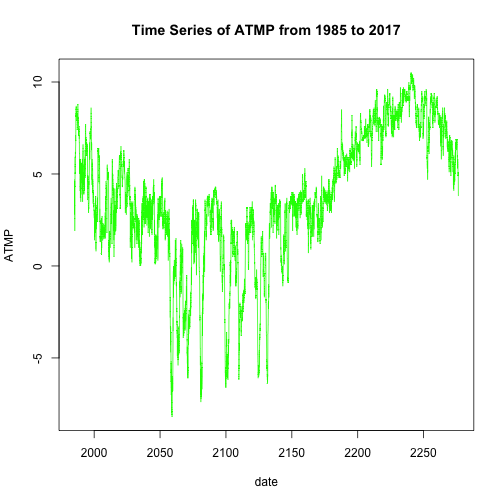
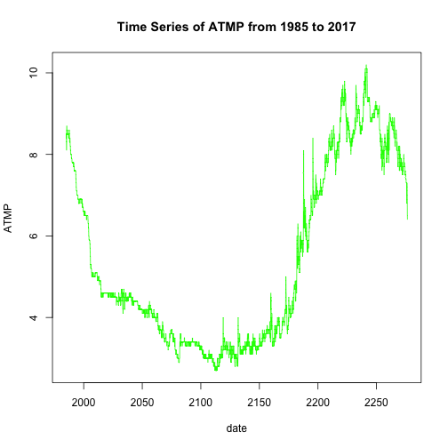

NOAA Weather Station Buoy 46035
========================================================
author: Kerin Grewal and Janie Briglio
date: March 20th 2018
autosize: true

Average Air Temperature
========================================================

<table class="table" style="margin-left: auto; margin-right: auto;">
<caption>Air Temp Averages</caption>
 <thead>
  <tr>
   <th style="text-align:left;"> YYYY </th>
   <th style="text-align:right;"> Mean </th>
   <th style="text-align:right;"> Number of Observations </th>
  </tr>
 </thead>
<tbody>
  <tr>
   <td style="text-align:left;"> 1985 </td>
   <td style="text-align:right;"> 3.6781265 </td>
   <td style="text-align:right;"> 2135 </td>
  </tr>
  <tr>
   <td style="text-align:left;"> 1986 </td>
   <td style="text-align:right;"> 3.5187827 </td>
   <td style="text-align:right;"> 8609 </td>
  </tr>
  <tr>
   <td style="text-align:left;"> 1987 </td>
   <td style="text-align:right;"> 1.7910481 </td>
   <td style="text-align:right;"> 6669 </td>
  </tr>
  <tr>
   <td style="text-align:left;"> 1988 </td>
   <td style="text-align:right;"> 2.4509888 </td>
   <td style="text-align:right;"> 8596 </td>
  </tr>
  <tr>
   <td style="text-align:left;"> 1989 </td>
   <td style="text-align:right;"> 3.3999764 </td>
   <td style="text-align:right;"> 8473 </td>
  </tr>
  <tr>
   <td style="text-align:left;"> 1990 </td>
   <td style="text-align:right;"> 2.9015114 </td>
   <td style="text-align:right;"> 3639 </td>
  </tr>
  <tr>
   <td style="text-align:left;"> 1991 </td>
   <td style="text-align:right;"> 0.4181801 </td>
   <td style="text-align:right;"> 5407 </td>
  </tr>
  <tr>
   <td style="text-align:left;"> 1992 </td>
   <td style="text-align:right;"> 2.6337827 </td>
   <td style="text-align:right;"> 8605 </td>
  </tr>
  <tr>
   <td style="text-align:left;"> 1993 </td>
   <td style="text-align:right;"> 3.3082587 </td>
   <td style="text-align:right;"> 8040 </td>
  </tr>
  <tr>
   <td style="text-align:left;"> 1994 </td>
   <td style="text-align:right;"> 2.4830053 </td>
   <td style="text-align:right;"> 6808 </td>
  </tr>
  <tr>
   <td style="text-align:left;"> 1995 </td>
   <td style="text-align:right;"> 4.3548425 </td>
   <td style="text-align:right;"> 6030 </td>
  </tr>
  <tr>
   <td style="text-align:left;"> 1996 </td>
   <td style="text-align:right;"> 2.7509615 </td>
   <td style="text-align:right;"> 6448 </td>
  </tr>
  <tr>
   <td style="text-align:left;"> 1997 </td>
   <td style="text-align:right;"> 3.5500594 </td>
   <td style="text-align:right;"> 8422 </td>
  </tr>
  <tr>
   <td style="text-align:left;"> 1998 </td>
   <td style="text-align:right;"> 2.3032080 </td>
   <td style="text-align:right;"> 8167 </td>
  </tr>
  <tr>
   <td style="text-align:left;"> 1999 </td>
   <td style="text-align:right;"> 2.1552795 </td>
   <td style="text-align:right;"> 7728 </td>
  </tr>
  <tr>
   <td style="text-align:left;"> 2000 </td>
   <td style="text-align:right;"> 3.1160969 </td>
   <td style="text-align:right;"> 7225 </td>
  </tr>
  <tr>
   <td style="text-align:left;"> 2001 </td>
   <td style="text-align:right;"> 0.2081977 </td>
   <td style="text-align:right;"> 1720 </td>
  </tr>
  <tr>
   <td style="text-align:left;"> 2002 </td>
   <td style="text-align:right;"> 4.6164097 </td>
   <td style="text-align:right;"> 4735 </td>
  </tr>
  <tr>
   <td style="text-align:left;"> 2003 </td>
   <td style="text-align:right;"> 4.2173575 </td>
   <td style="text-align:right;"> 8734 </td>
  </tr>
  <tr>
   <td style="text-align:left;"> 2004 </td>
   <td style="text-align:right;"> 3.9308017 </td>
   <td style="text-align:right;"> 8769 </td>
  </tr>
  <tr>
   <td style="text-align:left;"> 2005 </td>
   <td style="text-align:right;"> 3.6204117 </td>
   <td style="text-align:right;"> 8745 </td>
  </tr>
  <tr>
   <td style="text-align:left;"> 2006 </td>
   <td style="text-align:right;"> 2.8556885 </td>
   <td style="text-align:right;"> 8693 </td>
  </tr>
  <tr>
   <td style="text-align:left;"> 2007 </td>
   <td style="text-align:right;"> 0.8179042 </td>
   <td style="text-align:right;"> 5926 </td>
  </tr>
  <tr>
   <td style="text-align:left;"> 2008 </td>
   <td style="text-align:right;"> 2.5886976 </td>
   <td style="text-align:right;"> 8715 </td>
  </tr>
  <tr>
   <td style="text-align:left;"> 2009 </td>
   <td style="text-align:right;"> 0.6249514 </td>
   <td style="text-align:right;"> 5146 </td>
  </tr>
  <tr>
   <td style="text-align:left;"> 2010 </td>
   <td style="text-align:right;"> 0.5966450 </td>
   <td style="text-align:right;"> 4471 </td>
  </tr>
  <tr>
   <td style="text-align:left;"> 2011 </td>
   <td style="text-align:right;"> 1.3771930 </td>
   <td style="text-align:right;"> 969 </td>
  </tr>
  <tr>
   <td style="text-align:left;"> 2014 </td>
   <td style="text-align:right;"> 7.5242480 </td>
   <td style="text-align:right;"> 4355 </td>
  </tr>
  <tr>
   <td style="text-align:left;"> 2015 </td>
   <td style="text-align:right;"> 4.1657515 </td>
   <td style="text-align:right;"> 8742 </td>
  </tr>
  <tr>
   <td style="text-align:left;"> 2016 </td>
   <td style="text-align:right;"> 4.7496856 </td>
   <td style="text-align:right;"> 8747 </td>
  </tr>
  <tr>
   <td style="text-align:left;"> 2017 </td>
   <td style="text-align:right;"> 4.8160891 </td>
   <td style="text-align:right;"> 8484 </td>
  </tr>
</tbody>
</table>

Air Temperature Time Series
========================================================

Water Temperature Averages
========================================================

<table class="table" style="margin-left: auto; margin-right: auto;">
<caption>Water Temp Averages</caption>
 <thead>
  <tr>
   <th style="text-align:left;"> YYYY </th>
   <th style="text-align:right;"> Mean </th>
   <th style="text-align:right;"> Number of Observations </th>
  </tr>
 </thead>
<tbody>
  <tr>
   <td style="text-align:left;"> 1985 </td>
   <td style="text-align:right;"> 5.307728 </td>
   <td style="text-align:right;"> 2135 </td>
  </tr>
  <tr>
   <td style="text-align:left;"> 1986 </td>
   <td style="text-align:right;"> 5.290161 </td>
   <td style="text-align:right;"> 8609 </td>
  </tr>
  <tr>
   <td style="text-align:left;"> 1987 </td>
   <td style="text-align:right;"> 4.356665 </td>
   <td style="text-align:right;"> 6669 </td>
  </tr>
  <tr>
   <td style="text-align:left;"> 1988 </td>
   <td style="text-align:right;"> 4.611994 </td>
   <td style="text-align:right;"> 8596 </td>
  </tr>
  <tr>
   <td style="text-align:left;"> 1989 </td>
   <td style="text-align:right;"> 4.881954 </td>
   <td style="text-align:right;"> 8473 </td>
  </tr>
  <tr>
   <td style="text-align:left;"> 1990 </td>
   <td style="text-align:right;"> 4.919071 </td>
   <td style="text-align:right;"> 3639 </td>
  </tr>
  <tr>
   <td style="text-align:left;"> 1991 </td>
   <td style="text-align:right;"> 3.272018 </td>
   <td style="text-align:right;"> 5407 </td>
  </tr>
  <tr>
   <td style="text-align:left;"> 1992 </td>
   <td style="text-align:right;"> 4.801383 </td>
   <td style="text-align:right;"> 8605 </td>
  </tr>
  <tr>
   <td style="text-align:left;"> 1993 </td>
   <td style="text-align:right;"> 4.882152 </td>
   <td style="text-align:right;"> 8040 </td>
  </tr>
  <tr>
   <td style="text-align:left;"> 1994 </td>
   <td style="text-align:right;"> 4.609136 </td>
   <td style="text-align:right;"> 6808 </td>
  </tr>
  <tr>
   <td style="text-align:left;"> 1995 </td>
   <td style="text-align:right;"> 5.884843 </td>
   <td style="text-align:right;"> 6030 </td>
  </tr>
  <tr>
   <td style="text-align:left;"> 1996 </td>
   <td style="text-align:right;"> 4.142060 </td>
   <td style="text-align:right;"> 6448 </td>
  </tr>
  <tr>
   <td style="text-align:left;"> 1997 </td>
   <td style="text-align:right;"> 5.471100 </td>
   <td style="text-align:right;"> 8422 </td>
  </tr>
  <tr>
   <td style="text-align:left;"> 1998 </td>
   <td style="text-align:right;"> 4.509330 </td>
   <td style="text-align:right;"> 8167 </td>
  </tr>
  <tr>
   <td style="text-align:left;"> 1999 </td>
   <td style="text-align:right;"> 4.176152 </td>
   <td style="text-align:right;"> 7728 </td>
  </tr>
  <tr>
   <td style="text-align:left;"> 2000 </td>
   <td style="text-align:right;"> 4.719280 </td>
   <td style="text-align:right;"> 7225 </td>
  </tr>
  <tr>
   <td style="text-align:left;"> 2001 </td>
   <td style="text-align:right;"> 3.443140 </td>
   <td style="text-align:right;"> 1720 </td>
  </tr>
  <tr>
   <td style="text-align:left;"> 2002 </td>
   <td style="text-align:right;"> 6.394572 </td>
   <td style="text-align:right;"> 4735 </td>
  </tr>
  <tr>
   <td style="text-align:left;"> 2003 </td>
   <td style="text-align:right;"> 5.781841 </td>
   <td style="text-align:right;"> 8734 </td>
  </tr>
  <tr>
   <td style="text-align:left;"> 2004 </td>
   <td style="text-align:right;"> 5.640073 </td>
   <td style="text-align:right;"> 8769 </td>
  </tr>
  <tr>
   <td style="text-align:left;"> 2005 </td>
   <td style="text-align:right;"> 5.249583 </td>
   <td style="text-align:right;"> 8745 </td>
  </tr>
  <tr>
   <td style="text-align:left;"> 2006 </td>
   <td style="text-align:right;"> 5.134487 </td>
   <td style="text-align:right;"> 8693 </td>
  </tr>
  <tr>
   <td style="text-align:left;"> 2007 </td>
   <td style="text-align:right;"> 3.238913 </td>
   <td style="text-align:right;"> 5926 </td>
  </tr>
  <tr>
   <td style="text-align:left;"> 2008 </td>
   <td style="text-align:right;"> 4.850671 </td>
   <td style="text-align:right;"> 8715 </td>
  </tr>
  <tr>
   <td style="text-align:left;"> 2009 </td>
   <td style="text-align:right;"> 2.946424 </td>
   <td style="text-align:right;"> 5146 </td>
  </tr>
  <tr>
   <td style="text-align:left;"> 2010 </td>
   <td style="text-align:right;"> 3.004048 </td>
   <td style="text-align:right;"> 4471 </td>
  </tr>
  <tr>
   <td style="text-align:left;"> 2011 </td>
   <td style="text-align:right;"> 2.600619 </td>
   <td style="text-align:right;"> 969 </td>
  </tr>
  <tr>
   <td style="text-align:left;"> 2014 </td>
   <td style="text-align:right;"> 8.792974 </td>
   <td style="text-align:right;"> 4355 </td>
  </tr>
  <tr>
   <td style="text-align:left;"> 2015 </td>
   <td style="text-align:right;"> 5.908968 </td>
   <td style="text-align:right;"> 8742 </td>
  </tr>
  <tr>
   <td style="text-align:left;"> 2016 </td>
   <td style="text-align:right;"> 6.289459 </td>
   <td style="text-align:right;"> 8747 </td>
  </tr>
  <tr>
   <td style="text-align:left;"> 2017 </td>
   <td style="text-align:right;"> 6.157119 </td>
   <td style="text-align:right;"> 8484 </td>
  </tr>
</tbody>
</table>

Water Temperature Time Series
========================================================

