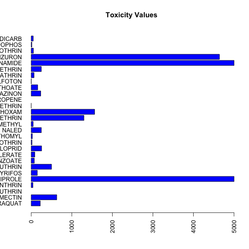

veg1 slides
========================================================
author: Janie Briglio and Kerin Grewal
date: 3/19/18
autosize: true

Introduction
========================================================
We looked at information from USDA QuickStats and looked at the following information:
- Commodity (broccoli, cauliflower, and other vegetables)
- Product (pesticide, insecticide, etc.)
- Chemical
- Toxicity 

With this information, we wanted to find which chemicals were restricted use and how toxic they are when consumed.

Cleaning the Data
========================================================
The original data contained: 
- repeated information that needed to be removed 
- information that needed to be separated into separate groups
- data that needed to be added

The data was cleaned and added to through pipes that: 
- separated and removed columns
- joined tables together 


Cleaned Tables
========================================================


```
# A tibble: 606 x 4
   Commodity type           chem                toxicity
   <chr>     <chr>          <chr>                  <dbl>
 1 BROCCOLI  " HERBICIDE"   PARAQUAT               223  
 2 BROCCOLI  " INSECTICIDE" ABAMECTIN              630  
 3 BROCCOLI  " INSECTICIDE" BETA-CYFLUTHRIN         NA  
 4 BROCCOLI  " INSECTICIDE" BIFENTHRIN              42.5
 5 BROCCOLI  " INSECTICIDE" CHLORANTRANILIPROLE   5000  
 6 BROCCOLI  " INSECTICIDE" CHLORPYRIFOS           151  
 7 BROCCOLI  " INSECTICIDE" CYFLUTHRIN             500  
 8 BROCCOLI  " INSECTICIDE" EMAMECTIN BENZOATE      76.0
 9 BROCCOLI  " INSECTICIDE" ESFENVALERATE           88.5
10 BROCCOLI  " INSECTICIDE" IMIDACLOPRID           256  
# ... with 596 more rows
```

Toxicity Table
========================================================

```
         [,1]
 [1,]  223.00
 [2,]  630.00
 [3,]      NA
 [4,]   42.50
 [5,] 5000.00
 [6,]  151.00
 [7,]  500.00
 [8,]   76.00
 [9,]   88.50
[10,]  256.00
[11,]   20.00
[12,]   27.40
[13,]  250.00
[14,]   48.00
[15,] 1300.00
[16,] 1563.00
[17,]    0.16
[18,]      NA
[19,]  235.00
[20,]  160.00
[21,]    2.60
[22,]   70.60
[23,]  250.00
[24,] 5000.00
[25,] 4640.00
[26,]   55.00
[27,]   16.00
[28,]   50.00
```


